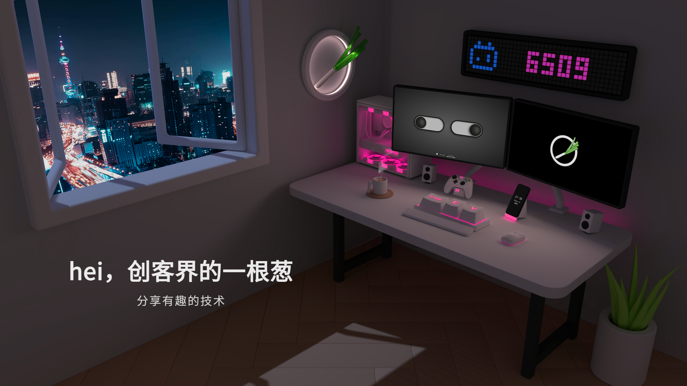
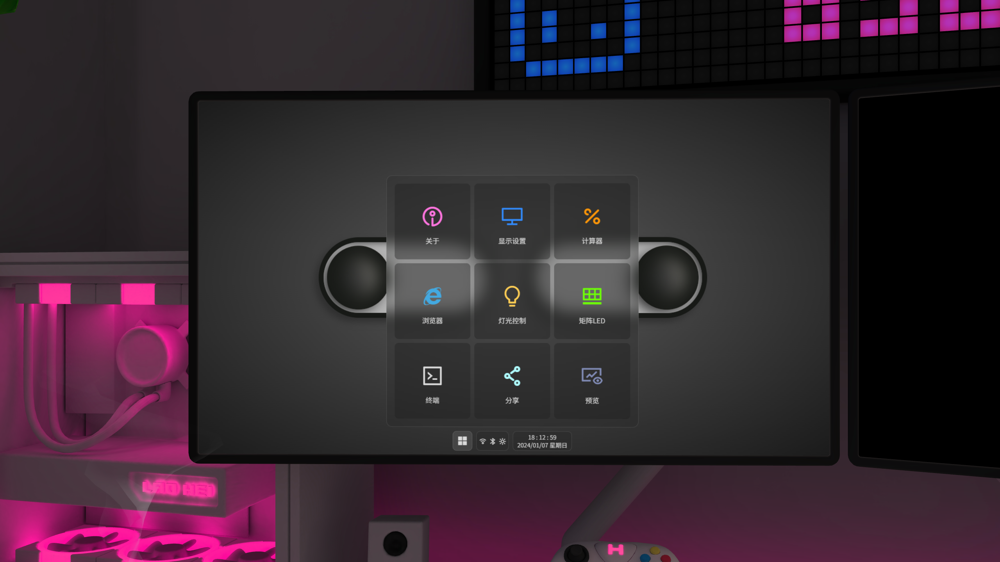
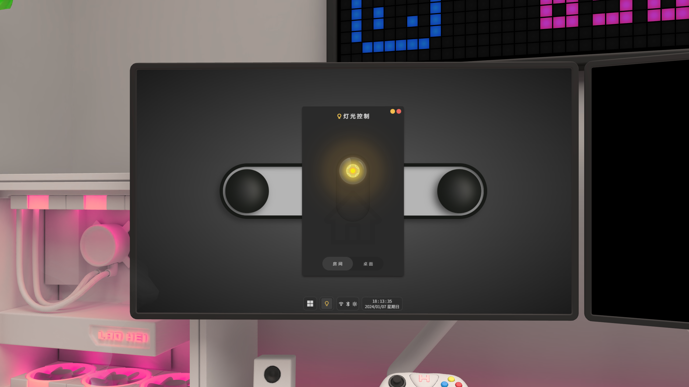
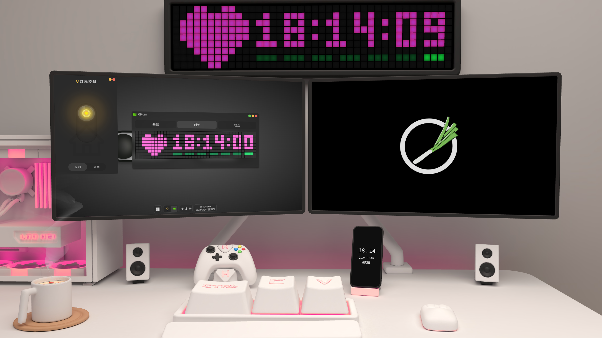

# 3D Interactive Room 3D交互房间

> 使用 `three.js` 开发的 3D可交互页面

以 vite+vue3 为基础，共两个页面的3D项目

- `/` 首页是整个3D模型场景，包括视角切换、灯光切换等
- `/hei-os` 场景中可交互的 **仿电脑系统**

两个页面通过 postMessage 进行操作交互，并通过 localStorage 共享数据，使用 hei-os 的仿系统就可以控制整个3D场景来实现开关灯、软件控制场景等交互

❗更多介绍有空再写，感兴趣的朋友可以下载代码研究研究

❗我也会录一期视频简单讲解一下代码

> ✨ 由于使用的是 `pnpm`+`vite`+`vue3` 为基础项目，所以需要对 vue3 开发有一定的了解，后期如果感兴趣的人多了之后，我会考虑录完整的手把手开发视频哦








## 代码调试


### 安装依赖
```sh
pnpm install
```

### 开发
```sh
pnpm dev
```

### 打包
```sh
pnpm build
```
